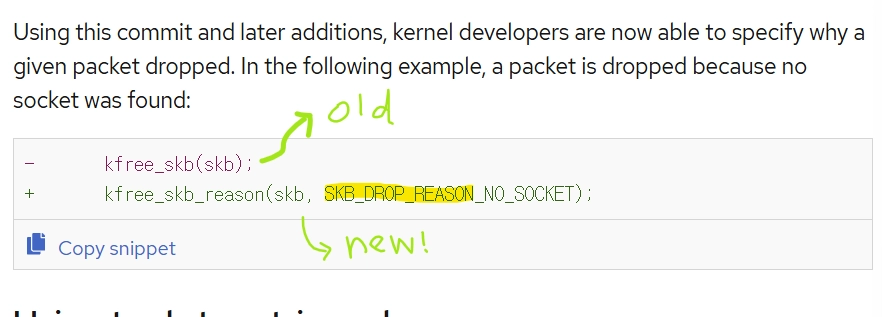

## 커널 메트릭은 왜 계층별로 보아야 할까?

복습겸, 계층별 주로 확인하는 커널 매트릭들 정리! (rocky linux 기준)

### 링크/NIC 계층 메트릭

NIC(하드웨어) 문제일까, 커널(소포트웨어) 문제일까?

NIC 메트릭은 네트워크 문제가 하드웨어에서 시작됐는지, 커널로 들어온 뒤에 생겼는지를 나누는 첫 번째 분기점!!

- `rx_dropped.nic`: **하드웨어 문제** (랜션 불량, 광케이블 노이즈 등등..)
- `rx_dropped`: **커널 문제**

rx_dropped.nic = 0 이면 NIC 하드웨어는 패킷을 정상 수신했다는 의미.

rx_dropped 가 증가하면 NIC 이후의 커널 소프트웨어 스택에서 패킷을 처리하지 못 하여 버렸다는 뜻 (IRQ Imbalance, 링버퍼 부족, CPU 포화 등등..)

### softnet / softirq 계층 메트릭

softnet 메트릭은 ‘커널이 수신된 패킷을 제때 소화하고 있는가’를 보여주는 소화 능력 지표

`/proc/net/softnet_stat`  ⇒ 해당 파일은 CPU별 네트워크 처리 상태를 보여준다.

아래는 파일의 주요 컬럼들

- `processed`: 이 CPU가 무사히 처리한 패킷 수
- `dropped`: backlog overflow 등으로 드롭된 패킷 수
- `time_squeeze`: 예산이 부족해서 이번 softirq 사이클에서 다 못 처리한 횟수
    - time_squeeze 값이 0이 아니라는 건? → 커널이 주어진 softirq 예산 안에서 패킷처리를 완수하지 못 함
    - 순간적인 패킷 버스트, CPU 과부화, 백로그 부족을 시사한다. 해당 부분을 점검해보아야 함

### TCP 계층 메트릭

패킷을 수신하긴 했는데 연결 품질이 나쁜가?

어플리케이션의 Latency 왜이렇게 느려 지연 문제의 대부분 문제 원인 지점이다.

- `ss -i`는 TCP 내부 정보를 보여주고
- `nstat`는 네트워크 통계 도구로, 프로토콜 카운터를 보여준다.

RTT, 재전송 수, cwnd 크기 등등을 확인하여, 어플리케이션 지연의 문제 원인을 파악해야 한다.

### drop reason 메트릭

요즘 리눅스 특징.

옛날에는 드롭이 몇 개 났구나 정도만 파악할 수 있었는데, 요즘엔 커널이 왜 드롭했는 지, 어디서 드롭했는 지, 어떤 커널 소스코드 함수 경로에서 버려졌는 지 알 수 있게 됐다.

소켓 버퍼의 `skb:kfree_skb` tracepoint 사용하기

https://developers.redhat.com/articles/2023/07/19/how-retrieve-packet-drop-reasons-linux-kernel#using_tools_to_retrieve_drop_reasons

※ reason 코드는 Stable ABI, 즉 고정된 규약이 아니기 때문에
커널 버전에 따라 에러 번호가 바뀔수 있다. 따라서 Raw data, 즉 원시 숫자를 수집하지 말고 실행중인 커널에 맞추어 텍스트로 번역해서 모니터링 해야한다고 한다.

## 모니터링 방식

eBPF가 좋다더라. 왜????

### 기존 방식 : procfs, ss, nstat

- `/proc` 파일 아래 지금까지의 총합(누적 카운트) 확인
    - 리눅스는 모든 것을 file로 관리한다.
      `procfs`(Process File System)는 리눅스 커널이 만든 Virtual File System 이다.
    - 터미널에서 `cat /proc/cpuinfo`나 `cat /proc/net/softnet_stat` 같은 명령어로 파일을 읽으려고 시도하면, 커널이 자기 메모리 상태를 확인하고 글자를 터미널 화면에 뿌려준다.. ex. 서버 켜진 이래로 처리한 패킷 수, 백로그 드랍 수 등등..
- `ss`가 보여주는 현재 TCP 상태
- `nstat`가 보여주는 프로토콜 통계

○ : 가볍고, 안정적이고, 어디에서나 쉽게 사용할 수 있다.

△ : 1초 단위 스냅샷 방식이라, 패킷 버스트나 드롭 같이 짧게 지나가는 이벤트들을 놓칠 수 있음. 세부 이유(언제 어떤 패킷이 어디에서 왜 문제인가) 안 보임

### tracepoint 방식

tracepoint는 커널이 미리 심어둔 **관측 포인트**

procfs가 “누적 통계”라면 tracepoint는 “사건 발생 순간”을 포착하는 방식

- 재전송이 실제로 발생한 순간
- 특정 패킷이 드롭된 순간
- TCP 상태가 바뀐 순간

을 이벤트 단위로 확인 가능

### eBPF 방식

eBPF는 이 tracepoint나 네트워크 경로(Tracepoint, XDP, TC, socket hook 등)에 **작은 프로그램을 안전하게 붙여서**, 커널을 수정하지 않고도 실시간 관측·필터링·집계를 하게 해주는 기술. **networking, observability, security** 전반에 걸친 핵심 기술!

## ebpf 적용 실사례와 이점

https://www.linuxfoundation.org/hubfs/eBPF/eBPF%20In%20Production%20Report.pdf

1. 종단 간(End-to-End) 정밀 측정을 통한 **탐지 시간(MTTD)**의 최소화

기존에는 장애가 애플리케이션에 도달해야만 증상을 인지할 수 있었다. 하지만 eBPF를 통해서는 네트워크 경로상의 모든 가상 인터페이스에서 Virtual Tapping과 패킷 추출을 수행한다. 지연, 지터, 패킷 손실, QoS 수치를 홉 바이 홉(Hop-by-hop)으로 추출하고 이를 AI 에이전트와 연동함으로써, 트래픽 폭주나 런타임 실패가 발생하기 **전!!!** 이상 징후를 선제적으로 감지할 수 있게 됐다.

1. 크로스 레이어(Cross-layer) 분석을 통한 **복구 시간(MTTR)**의 최소화

일반적으로 장애가 발생하면 '네트워크 계층의 문제인지, 애플리케이션의 문제인지'를 두고 파편화된 디버깅을 진행한다. 그러나 eBPF는 네트워크 메트릭뿐만 아니라, 그 순간의 시스템 콜(Syscall), 프로세스 동작 상태, 보안 시그니처까지 커널 레벨의 컨텍스트를 하나로 묶어 제공한다. 이를 통해 엔지니어는 현상에 대한 추측 없이, 근본 원인(Root-Cause)을 즉각적으로 특정하고 복구 프로세스에 진입할 수 있다.

1. 관측 오버헤드의 최소화

우리가 시스템을 모니터링할 때 가장 경계하는 것이 바로 관측 도구 자체가 시스템 부하를 유발하는 '옵저버 효과(Observer Effect)’이다.

기존의 무거운 에이전트 기반 방식과 달리, eBPF는 커널 내부에서 네이티브하게 동작하므로 고부하 트래픽 상황에서도 시스템에 부담을 주지 않고 24시간 상시(Always-on) 관측을 수행할 수 있다.

eBPF는 단순한 디버깅 도구를 넘어 **문제를 가장 먼저 알아차리고(MTTD 감소), 가장 빠르게 원인을 짚어내며(MTTR 감소), 시스템 자원을 낭비하지 않는** 짱 효율적인 옵저버빌리티 기술이다!