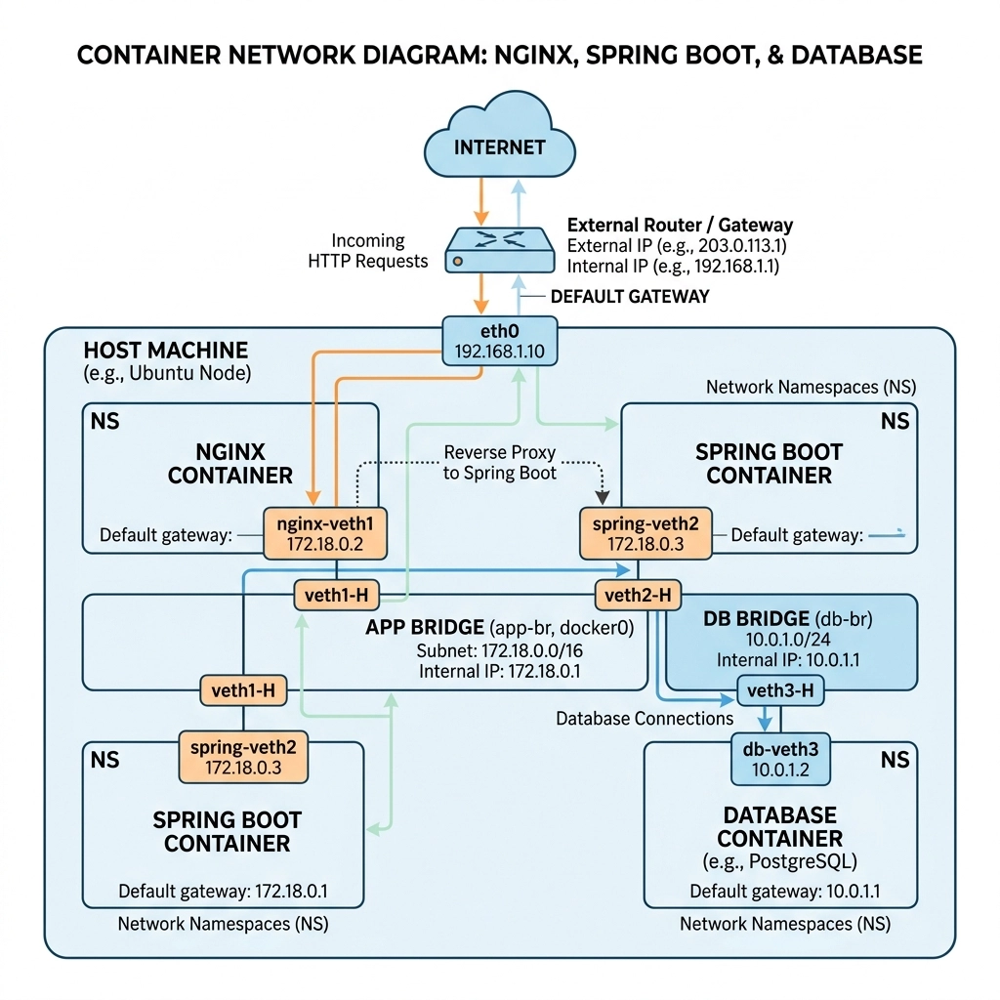

# 기본 네트워크

같은 네트워크면 스위치만 있으면 된다 (같은 서브넷이면)

다른 네트워크라면 라우터가 필요하다

라우터를 쓰려면 (외부 네트워크로 데이터를 보내고 싶다면) 나의 호스트가 게이트웨이를 알아야 한다

- 게이트웨이 : 다른 서브넷에 있어서 인터넷으로 나가야 할 때, 들려야하는 내 서브넷 안의 출구 IP 주소
- 라우터: 서로 다른 서브넷 간에 L3 패킷 포워딩하는 장비
- 보통 라우터가 게이트웨이 역할을 한다.

인터넷처럼 목적지가 너무 많으면 (내가 모르는 주소로 가는 데이터면) **default route** 로 보낸다.

# 리눅스 호스트를 라우터처럼 쓰려면

호스트 B가 `eth0`, `eth1` 두 네트워크에 동시에 연결되어 있으면, 이론상 B는 라우터처럼 보인다.

그런데 실제로는 **기본 설정만으로는 포워딩이 안 된다.**
이유는 리눅스가 기본적으로 **IP forwarding** 을 꺼두기 때문이다.
즉 “내가 직접 받는 패킷”만 처리하고, “남의 패킷을 다른 인터페이스로 넘기는 일”은 기본적으로 막아둔다.

그래서 두 네트워크를 이어주는 진짜 중간 장치로 쓰려면:

- 양쪽 호스트에 **route** 를 추가하고
- 가운데 호스트에서 **ip_forward=1** 을 켜야 한다
    - **`ip_forward=1` 켜기:** A가 C에게 보내는 패킷이 B로 들어왔을 때, 리눅스 기본 설정이었다면 B는 "내 IP로 온 게 아니네?" 하고 패킷을 폐기(Drop)해 버립니다. 여기서 IP 포워딩을 켜주면, B가 "아, 이거 내가 받아서 `eth1` 쪽으로 넘겨줘야 하는구나" 하고 라우터처럼 동작하게 됩니다.

# 네트워크 네임스페이스: 컨테이너 네트워크

**네트워크 네임스페이스(netns)**
: 하나의 리눅스 머신 안에 **서로 완전히 격리된 작은 네트워크 공간**을 만드는 기능

각 네임스페이스는 자기만의:

- 인터페이스
- IP 주소
- 라우팅 테이블
- ARP 테이블

를 갖는다.

도커같은 컨테이너는 리눅스의 네임스페이스 기능을 이용한 거임 (namespace와 cgroup 기능 이용)

컨테이너 안에서는 자신의 네임스페이스만 확인하므로, 컨테이너 입장에서는 자기가 완전히 독립된 컴퓨터라고 보인다.

- 컨테이너 안에서 `ifconfig` 쳐보면 자신의 IP만 보인다

# veth pair: 네임스페이스를 잇는 가상 케이블

Virtual Ethernet Pair

네임스페이스는 격리되어 있으니, 서로 연결하려면 “가상의 랜선”이 필요하다.

리눅스 커널에서 제공하는 가상의 네트워크 인터페이스

항상 두 개의 인터페이스가 상호 연결된 한 쌍(Pair)으로 생성된다.

1. **생성 및 분배:** 컨테이너가 실행되면 리눅스 커널은 새로운 `netns`와 함께 `veth pair`를 하나 생성합니다.
2. **컨테이너 내부 할당:** 쌍 중 하나의 인터페이스를 컨테이너 내부의 `netns`로 이동시킵니다. 그리고 이름을 보통 `eth0`으로 변경하고 IP 주소를 할당합니다. 컨테이너 내부의 프로세스는 이를 일반적인 물리 랜카드처럼 인식합니다.
3. **호스트 잔류:** 쌍의 나머지 한쪽 인터페이스는 호스트의 Root Namespace에 남겨둡니다. 이 인터페이스는 보통 `veth1234abcd`와 같은 임의의 식별자 이름을 가집니다.
4. **브리지 연결 (L2 Switching):** 호스트에 남겨진 `vethXXXX` 인터페이스는 `docker0` (또는 cni0) 와 같은 가상 브리지(Virtual Bridge) 장치에 포트로 연결(Attach)됩니다.

# ARP

Address Resolution Protocol (L2)

로컬 통신만 지원됨 → 서브넷 내에 모든 노드에 ARP 요청을 보내지만, 라우터(L3 장비)는 기본적으로 브로드캐스트 패킷을 다른 서브넷으로 포워딩하지 않고 Drop 한다.

- Red 네임스페이스가 Blue 네임스페이스로 데이터를 보내려 한다
- 라우팅 테이블을 확인해보니 같은 서브넷 대역임을 확인했다
- 하지만 Blue의 MAC 주소를 모르기에 Red는 목적지 MAC 주소를 FF:FF:FF:FF:FF:FF 로 설정하여, Blue의 IP를 가진 인터페이스는 MAC 주소를 알려달라는 ARP 요청 (Broadcast) 을 서브냇 내에 전체 발송한다.
- 해당 IP를 가진 Blue가 자신의 MAC 주소를 담아 Red에게만 단방향 응답한다. (Unicast) Red는 이를 ARP 테이블에 캐싱하고 패킷 전송 시작

외부 서브넷과 통신할 때는? → ARP로 **디폴트 게이트웨이의 IP 주소**를 찾는다.

# Bridge

리눅스의 veth pair는 1대1 연결이다.

따라서 네임스페이스(컨테이너)가 세 대 이상 있을 때 브릿지가 비로소 필요해짐

- 호스트 머신에 리눅스 브릿지(docker0)을 생성 - L2 스위치
- 호스트 측에 남겨진 여러 개의 `veth` 인터페이스들(`veth-red`, `veth-blue`, `veth-green` 등)을 모두 이 하나의 브리지에 포트로 연결됨
- 브리지에 묶인 모든 veth 인터페이스들은 동일한 **하나의 LAN 영역**에 속하게 된다

  == 서브넷 하나당 하나의 브릿지

원래 브릿지가 없다면 컨테이너 A는 영원히 호스트랑만 소통하는거임

근데 A의 컨테이너와 호스트랑 연결된 veth가, 호스트 머신 안의 하나의 브릿지에 연결되어있으니까

A가 ARP로 브로드캐스트 함 → veth로 나와서 브릿지로 들어감 → 브릿지에 연결된 다른 포트들한테도 각각의 veth를 통해서 뿌려짐 (Flooding)

# NAT와 포트포워딩

컨테이너들의 IP (192, 172 등)는 호스트 내부에서만 유효한 사설 IP이다.

외부 인터넷망의 라우터들은 해당 IP봐도 뭐임 이거 이렇게 댄다

리눅스의 iptables 를 이용하여 IP 헤더를 조작하자

- 아웃바운드 SNAT

  컨테이너가 8.8.8.8로 패킷을 보낼 때,

  호스트의 물리 NIC를 빠져나가기 직전에 **패킷의 출발지 Source IP**를 컨테이너 IP → **호스트의 Public IP**로 덮어쓰기

- 인바운드 DNAT (포트포워딩)

  외부 클라이언트가 호스트의 특정 포트로 요청을 보낼 때,

  호스트의 커널은 iptables 규칙을 확인하고, **패킷의 목적지 Dest IP & 포트**를 호스트 Public IP → **컨테이너의 사설 IP & 내부 포트**로 덮어쓰기

# Docker 네트워크가 하는 일

도커 데몬이 하는 일은

리눅스 커널에 있는 기능들을 자동으로 순서대로 실행해주는 것이다.

docker run 명령어 실행하면??

1. netns 생성 :
   `ip netns add <컨테이너_이름>` (격리된 네트워크 공간 생성)
2. veth pair 생성 :
   `ip link add type veth` (가상 랜선 2개 쌍 생성)
3. 브릿지(docker0) 생성과 연결 :
   `brctl addbr docker0` (가상 스위치 생성)
   `brctl addif docker0 veth0`  (브리지에 veth 연결)
4. IP 할당 및 라우팅 :
   `ip addr add 172.17.0.2/16 dev eth0` (veth에 사설 ip 부여)
   ⇒ 여기 eth0는 컨테이너의 veth임! 호스트와 인터넷 사이 물리 NIC가 아니다.
   `ip route add default via 172.17.0.1` (스위칭이 아닌 라우팅이 필요한 외부 인터넷행 패킷은, 지금 설정하는 디폴트 라우트 IP로 가거라)
5. NAT 포트포워딩 설정 :
   `iptables -t nat -A ...` (SNAT, DNAT 규칙 커널에 등록)

※ 호스트 단위 > 서브넷/브릿지 단위 > 컨테이너/ns 단위

하나의 호스트 안에 두 개의 서브넷(nginx,spring / db)

각 컨테이너에서 인터넷으로 아웃바운드 하는 패킷 보낼 때 → 브릿지 ip로 보냄. 얘가 곧 컨테이너의 디폴트 게이트웨이

호스트 머신에서의 디폴트 게이트웨이는 eth0(물리 NIC) 와 연결되어있는 외부 라우터